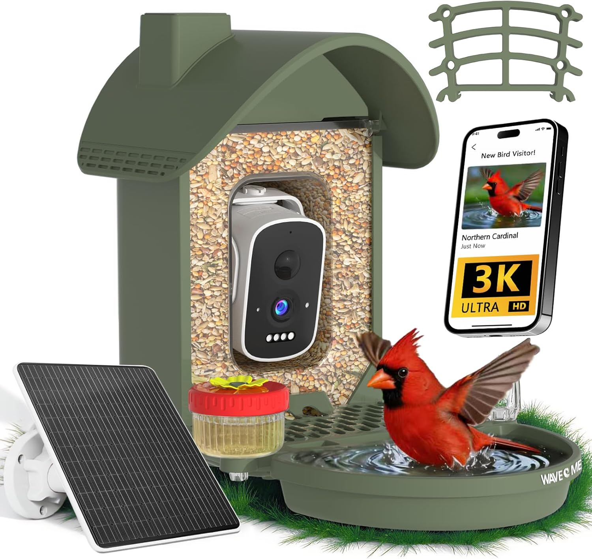
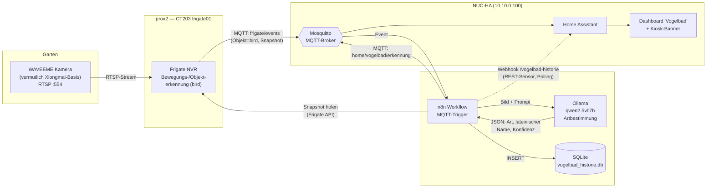

# IceBirdwatch

Lokale, KI-gestützte Vogelerkennung für ein Solar-Vogelbad mit Kamera —
**ohne Cloud-Abo**, komplett auf eigener Infrastruktur.

## Ausgangslage

Das Gerät ([WAVEEME Vogelhaus mit Kamera, 3K, Solar, KI-Vogelerkennung & Vogeltränke](https://www.amazon.de/dp/B0GJS3ZBTQ),
ca. 67€) bringt eine herstellereigene App samt Cloud-KI mit — die
Vogelerkennung ist dort nur 1 Monat kostenlos, danach vermutlich
abopflichtig. Ziel dieses Projekts: die Artbestimmung stattdessen über eine
**selbst gehostete Ollama-Vision-KI** laufen zu lassen und die Ergebnisse in
**Home Assistant** anzuzeigen — ganz ohne Abo und ohne dass Bilder das
Heimnetz verlassen.

## Architektur

**Warum n8n als Zwischenschicht statt direkt Frigate → Ollama?** Damit sich
der Ollama-Prompt (Sprache, gewünschtes Antwortformat, zusätzliche Hinweise
wie Region/Jahreszeit) jederzeit **ohne Code-Änderung** in der n8n-UI
anpassen lässt.

## Komponenten

| Komponente | Host | Zweck |
|---|---|---|
| Frigate | prox2 / CT203 (`frigate01`) | Nimmt RTSP-Stream, erkennt Bewegung + Objektklasse "bird", erzeugt Snapshots |
| n8n | ki02 (10.10.0.210:5678) | Orchestriert Erkennung → Ollama → Speicherung → MQTT |
| Ollama (qwen2.5vl:7b) | ki02 (10.10.0.210:11434) | Vision-KI für Artbestimmung (Umgangssprachlich + lateinisch) |
| Mosquitto | NUC-HA (10.10.0.100:1883) | MQTT-Broker (Home-Assistant-Addon) |
| Home Assistant | NUC-HA | Dashboard, Kiosk-Benachrichtigung, Sensor-Historie |

## Status

- [x] Frigate-Container vorbereitet (Platzhalter-RTSP-URL)
- [x] n8n-Workflows erstellt (Import ausstehend)
- [x] Home-Assistant-Package + Dashboard + Kiosk-Banner vorbereitet
- [ ] Echte Kamera-RTSP-URL eingetragen (nach Lieferung)
- [ ] n8n-Workflows importiert + aktiviert
- [ ] Home Assistant neu geladen / getestet

Details siehe [docs/setup.md](docs/setup.md), Hardware-Hintergrund siehe
[docs/hardware.md](docs/hardware.md).

## Keine sensiblen Daten in diesem Repo

Alle Beispiel-Configs verwenden Platzhalter (`TODO-KAMERA-IP`,
`REPLACE_MIT_..._CREDENTIAL_ID`) bzw. referenzieren Home-Assistant-`!secret`-
Einträge. Echte Zugangsdaten, IPs und Passwörter liegen ausschließlich in den
privaten `secrets.yaml`/Credential-Stores der jeweiligen Systeme, nicht hier.
