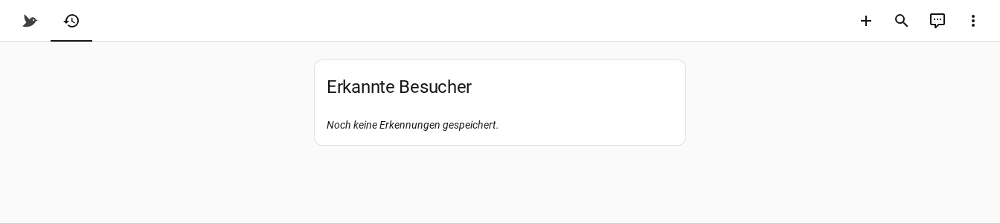

# Home Assistant Integration

Ein eigenes Dashboard "Vogelbad" mit zwei Ansichten, plus ein Kiosk-Banner,
das bei neuer Erkennung kurz im Haupt-Dashboard aufblitzt.

## Übersicht

Live-Bild (Snapshot von Frigate, alle paar Sekunden aktualisiert), aktuelle
Art + Konfidenz, Zeitpunkt der letzten Sichtung, Link zu Frigate.


## Historie

Tabelle aller bisherigen Erkennungen (umgangssprachlicher Name,
lateinischer Name, Datum/Uhrzeit, kleines Bild). Zustand hier: noch keine
echte Erkennung — die Pipeline läuft, wartet aber noch auf den ersten
echten Vogel vor der Kamera.



Technisch ein einzelner `markdown`-Card mit Jinja-Schleife über die
Einträge, die ein REST-Sensor per Polling von n8ns Historie-Webhook holt
(alle 2 Minuten, oder sofort bei neuer MQTT-Erkennung).

## Kiosk-Banner

Falls bereits ein Kiosk-/Wandtablet-Dashboard existiert: ein zusätzlicher
`conditional`-Card (`examples/ha-kiosk-banner-snippet.yaml`), der bei einer
Erkennung der letzten 90 Sekunden automatisch einblendet — grüner Rahmen,
Vogel-Icon, Art + lateinischer Name, tippen navigiert direkt zur
Vogelbad-Historie. Blendet danach von selbst wieder aus, kein manuelles
Wegklicken nötig.

## Entities

| Entity | Typ | Quelle |
|---|---|---|
| `sensor.vogelbad_letzte_erkennung` | MQTT-Sensor | `home/vogelbad/erkennung` (retained), Attribute: `lateinisch`, `konfidenz`, `anmerkung`, `zeitstempel`, `bild_url` |
| `sensor.vogelbad_historie_liste` | Template-Sensor (trigger-based) | REST-Sensor pollt n8n-Webhook, Attribut `eintraege` enthält die letzten 50 Erkennungen als Liste |
| `automation.vogelbad_neue_erkennung_notification` | Automation | feuert `persistent_notification.create` bei jeder neuen Erkennung |

## Einrichtung

1. `examples/ha-package-vogelbad_kamera.yaml` nach `packages/` kopieren,
   `<n8n-host>` durch die echte n8n-Adresse ersetzen.
2. `examples/ha-dashboard-vogelbad.yaml` nach `dashboards/` kopieren,
   `<frigate-host>` ersetzen.
3. In `configuration.yaml` unter `lovelace: dashboards:` registrieren:
   ```yaml
   lovelace:
     mode: storage
     dashboards:
       lovelace-vogelbad:
         mode: yaml
         title: Vogelbad
         icon: mdi:bird
         filename: dashboards/vogelbad.yaml
   ```
4. Optional: Kiosk-Banner-Snippet in ein bestehendes Kiosk-Dashboard
   einfügen (`examples/ha-kiosk-banner-snippet.yaml`).
5. **Einstellungen → System → Neu laden → YAML-Konfiguration neu laden**
   (Packages + Dashboards) — kein voller Neustart nötig, außer beim allerersten
   Einrichten (neue Packages werden zuverlässiger nach einem vollen
   `Einstellungen → System → Neustart` erkannt).

## Test ohne Kamera

Der komplette Home-Assistant-Teil lässt sich unabhängig von
Frigate/n8n/Kamera durchtesten, indem man eine Testnachricht direkt auf
den MQTT-Topic schickt:

```bash
mosquitto_pub -h <mqtt-broker-ip> -u <user> -P <passwort> \
  -t home/vogelbad/erkennung \
  -m '{"umgangssprachlich":"Blaumeise","lateinisch":"Cyanistes caeruleus","konfidenz":0.93,"anmerkung":"Test","zeitstempel":"2026-07-17T08:00:00","bild_url":"https://example.invalid/test.jpg"}'
```

Sensor, Dashboard, Kiosk-Banner und Notification sollten daraufhin sofort
reagieren.
