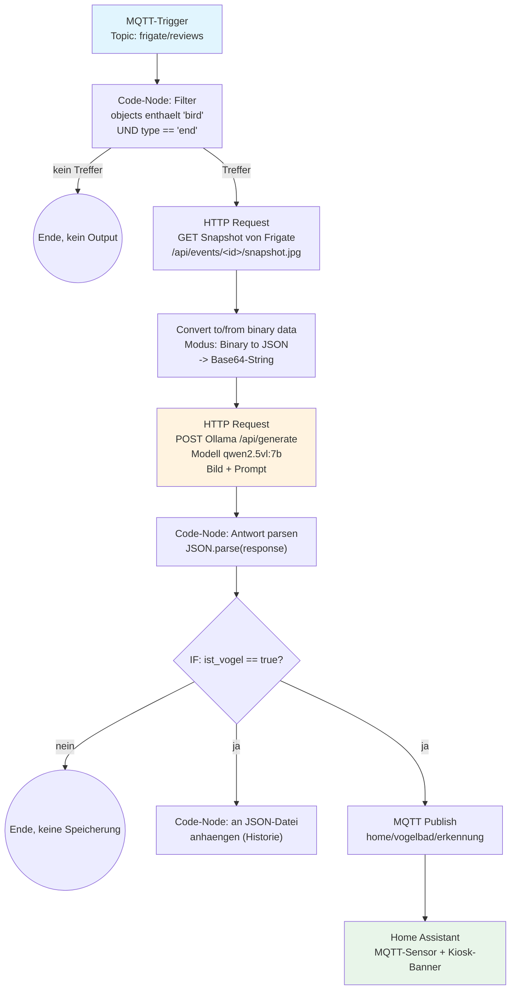
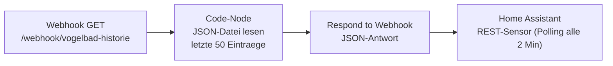

# Lokale Vogelerkennung (n8n + Ollama)

Kernstück des ganzen Projekts: die Artbestimmung läuft komplett lokal, ohne
Cloud-Abo und ohne dass ein Bild das Heimnetz verlässt. Zwei n8n-Workflows
übernehmen das — einer verarbeitet neue Erkennungen, der andere liefert die
Historie an Home Assistant.

## Warum n8n als Zwischenschicht statt Frigate direkt an Ollama?

Frigate selbst kann Snapshots nehmen, aber keine Vision-KI ansprechen und
das Ergebnis strukturiert weiterverarbeiten. n8n übernimmt genau das —
und der große Vorteil: **der komplette Ollama-Prompt lässt sich jederzeit
in der n8n-UI anpassen**, ohne Code, ohne Neustart, ohne Redeploy. Wer die
KI z.B. auch auf Eichhörnchen oder Igel ansetzen will, ändert einfach den
Prompt-Text im entsprechenden Node.

## Workflow 1: Erkennung (`n8n_workflow_erkennung.json`)



### Node für Node

| # | Node | Zweck |
|---|---|---|
| 1 | **MQTT: Frigate Reviews** | Abonniert `frigate/reviews`. Feuert bei jedem Bewegungs-/Objekt-Event, nicht nur bei Vögeln — die eigentliche Filterung passiert im nächsten Node. |
| 2 | **Filter: neues Vogel-Event mit Snapshot** | Code-Node. Prüft `payload.after.data.objects` (Array, z.B. `["bird"]`) und `payload.type === 'end'` (Review-Segment abgeschlossen, nicht nur "update"). Gibt bei Nicht-Treffer ein leeres Array zurück — der Workflow endet dort einfach, ohne Fehler. |
| 3 | **Frigate: Snapshot holen** | HTTP-GET auf Frigates eigene Events-API, liefert das JPEG des erkannten Objekts. |
| 4 | **Bild zu Base64** | Wandelt das Binärbild in einen Base64-String um, den Ollama versteht. Wichtig: der native "Convert to/from binary data"-Node, kein Code-Node (Details siehe [setup.md](setup.md)). |
| 5 | **Ollama: qwen2.5vl Artbestimmung** | POST an `/api/generate` mit `"format":"json"` — zwingt Ollama zu strukturierter JSON-Ausgabe statt Fließtext. **Hier lässt sich der Prompt anpassen.** |
| 6 | **Ollama-Antwort parsen** | Parst die JSON-Antwort, fängt Parse-Fehler ab (z.B. falls das Modell doch mal kein valides JSON liefert). |
| 7 | **IF: ist_vogel** | Verzweigt: nur wenn die KI tatsächlich ein Tier erkannt hat, wird gespeichert/gemeldet. Verhindert, dass leere Wind-/Schatten-Trigger als "Vogel" landen. |
| 8a | **Historie: an JSON-Datei anhängen** | Liest die bestehende Historie-Datei, hängt den neuen Eintrag vorne an, kappt bei 200 Einträgen, schreibt zurück. |
| 8b | **MQTT: an Home Assistant publishen** | Publiziert das Ergebnis auf `home/vogelbad/erkennung` (retained) — davon liest Home Assistants MQTT-Sensor. |

### Der Ollama-Prompt

```text
Du bist ein Ornithologe. Bestimme die Vogel- oder Tierart auf diesem Foto
einer Vogeltraenke in einem deutschen Garten. Antworte AUSSCHLIESSLICH als
JSON-Objekt mit genau diesen Feldern: {"umgangssprachlich": "deutscher
Trivialname, z.B. Blaumeise", "lateinisch": "wissenschaftlicher Name, z.B.
Cyanistes caeruleus", "konfidenz": Zahl zwischen 0 und 1, "ist_vogel":
true/false, "anmerkung": "kurze Notiz, z.B. Beleuchtung schlecht,
teilweise verdeckt"}. Falls kein Tier erkennbar ist, setze ist_vogel auf
false und umgangssprachlich auf 'kein Tier erkennbar'.
```

Das `"format": "json"` im HTTP-Request-Body (nicht im Prompt-Text) ist der
eigentliche Trick, der Ollama zu striktem JSON statt Fließtext-Antworten
zwingt — Ollamas natives Feature für strukturierte Ausgabe, nicht nur eine
Bitte im Prompt.

## Workflow 2: Historie-API (`n8n_workflow_historie.json`)



Simpel gehalten: Home Assistant pollt diesen Webhook periodisch und zeigt
das Ergebnis als Tabelle im Dashboard (siehe [homeassistant.md](homeassistant.md)).

## Warum keine Datenbank?

Ursprünglich war SQLite als Historie-Speicher vorgesehen. Aktuelle
n8n-Versionen bringen aber keinen SQLite-Node mehr mit — daher landet die
Historie als einfache JSON-Datei im n8n-Datenverzeichnis, direkt per `fs`
in den Code-Nodes gelesen/geschrieben. Für ein paar hundert Erkennungen
reicht das locker und spart ein zusätzliches Credential.

## Modellwahl

`qwen2.5vl:7b` lief bei uns stabil auf einer bestehenden Ollama-Instanz mit
2x RTX 3060. Jedes Ollama-Vision-Modell, das `/api/generate` mit
`images: [...]` unterstützt, funktioniert grundsätzlich — bei schwächerer
Hardware lohnt sich der Test mit einem kleineren Modell und ein Vergleich
der Erkennungsqualität.
