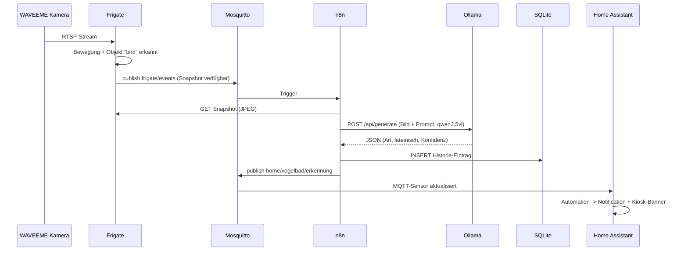

# Setup

## Ablauf einer Erkennung



## 1. Frigate (`examples/frigate-config.yml`)

Läuft als Docker-Container (`examples/frigate-compose.yml`). Wichtigster
Schritt nach Kamera-Diagnose (siehe [hardware.md](hardware.md)):

```yaml
cameras:
  vogelbad:
    ffmpeg:
      inputs:
        - path: rtsp://<user>:<passwort>@<kamera-ip>:554/user=<user>&password=<passwort>&channel=1&stream=0.sdp
```

Danach `docker compose restart`. Web-UI unter `http://<frigate-host>:5000`.

## 2. n8n-Workflows

Zwei Workflows, in der n8n-UI über **Import from File** einzulesen:

- `examples/n8n_workflow_erkennung.json` — MQTT-Trigger, holt Snapshot,
  fragt Ollama, speichert Historie, publisht an MQTT.
- `examples/n8n_workflow_historie.json` — Webhook-Endpoint
  `/webhook/vogelbad-historie`, liefert die letzten 50 Erkennungen als JSON
  für Home Assistant.

Nach Import:

1. **MQTT-Credential** anlegen (Broker-Host/Port/User/Passwort des eigenen
   Mosquitto) und in beiden MQTT-Nodes zuweisen.
2. **SQLite-Credential** anlegen, Pfad auf die Datenbankdatei im n8n-
   Datenverzeichnis (`~/.n8n/vogelbad_historie.db`) zeigen lassen. Schema:
   ```sql
   CREATE TABLE IF NOT EXISTS vogelbad_historie (
     id INTEGER PRIMARY KEY AUTOINCREMENT,
     event_id TEXT,
     umgangssprachlich TEXT,
     lateinisch TEXT,
     konfidenz REAL,
     anmerkung TEXT,
     zeitstempel TEXT,
     bild_url TEXT
   );
   ```
3. Beide Workflows **aktivieren**.
4. **Ollama-Prompt anpassen**: Node "Ollama: qwen2.5vl Artbestimmung" im
   ersten Workflow → `jsonBody` → Feld `prompt`. Genau hier ist der Punkt, an
   dem sich Sprache, Detailgrad oder Sonderregeln (z.B. "auch Eichhörnchen
   erkennen") ändern lassen, ohne Code anzufassen.

## 3. Home Assistant

- `examples/ha-package-vogelbad_kamera.yaml` → nach `packages/` kopieren.
  Enthält MQTT-Sensor, REST/Template-Sensor für die Historie, und die
  Notification-Automation.
- `examples/ha-dashboard-vogelbad.yaml` → nach `dashboards/` kopieren, dazu
  in `configuration.yaml` unter `lovelace: dashboards:` registrieren.
- `examples/ha-kiosk-banner-snippet.yaml` → als zusätzliche Karte in ein
  bestehendes Kiosk-Dashboard einfügen (zeigt neue Erkennung 90 Sekunden
  lang an, blendet danach automatisch aus).

Nach dem Einfügen: **Einstellungen → System → Neu laden → YAML-
Konfiguration neu laden** (Packages + Dashboards), kein voller Neustart
nötig.

## Test ohne Kamera

Die Pipeline lässt sich vor der Kamera-Inbetriebnahme durchtesten, indem man
per `mosquitto_pub` manuell eine Testnachricht auf `home/vogelbad/erkennung`
schickt:

```bash
mosquitto_pub -h <mqtt-broker-ip> -u <user> -P <passwort> \
  -t home/vogelbad/erkennung \
  -m '{"umgangssprachlich":"Blaumeise","lateinisch":"Cyanistes caeruleus","konfidenz":0.93,"anmerkung":"Test","zeitstempel":"2026-07-17T08:00:00","bild_url":"https://example.invalid/test.jpg"}'
```

Damit lässt sich der Home-Assistant-Teil (Sensor, Dashboard, Kiosk-Banner,
Notification) unabhängig von Frigate/n8n/Kamera verifizieren.
